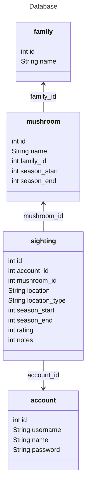

```mermaid
---
title: Database
---
classDiagram
    class family{
        int id
        String name
    }
    class mushroom{
        int id
        String name
        int family_id
        int season_start
        int season_end
    }
    class account{
    int id
    String username
    String name
    String password
    }
    class sighting {
        int id
        int account_id
        int mushroom_id
        String location
        String location_type
        int season_start
        int season_end
        int rating
        int notes
    }
    family <-- mushroom : family_id
    sighting --> account : account_id
    mushroom <-- sighting : mushroom_id
```